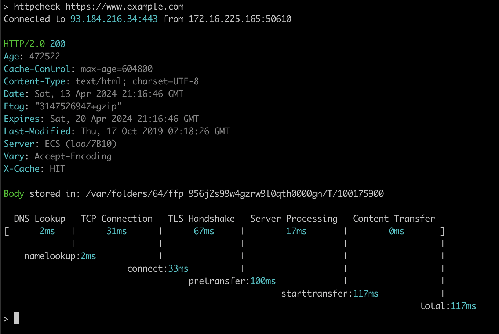

httpcheck
=========

httpcheck is a command-line tool for measuring HTTP performance. 



### Installation

```bash
go install github.com/ptrhng/httpcheck@latest
```

### Usage

Default:

```bash
$ httpcheck httpie.io/hello
```

Custom HTTP method, HTTP header, and JSON data:

```bash
$ httpcheck PUT pie.dev/put X-API-Token:123 name=John obj:='{"k": "v"}'
```
